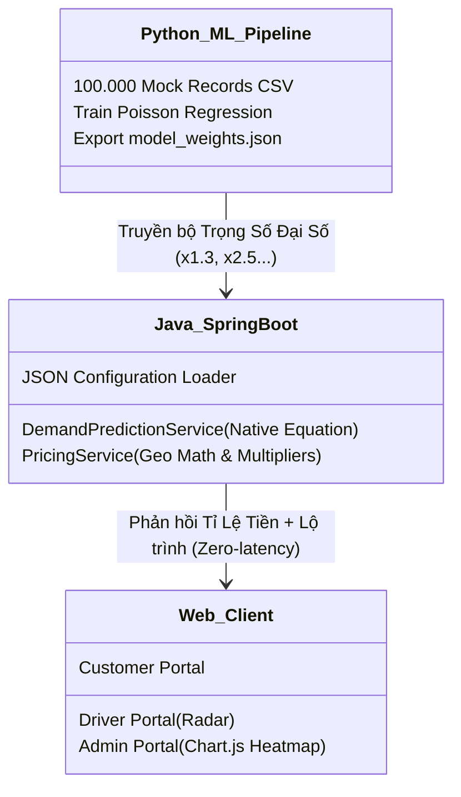

# 🚖 Taxi Dispatch System - Pro Edition
*(Mô Phỏng Tổng Đài Điều Phối Taxi Tích Hợp Machine Learning)*


Đồ án môn học phân hệ **Backend (Spring Boot + Firestore)** tích hợp trực tiếp với model **Machine Learning (Học máy thống kê)** phân tích nhu cầu gọi xe của hệ thống Taxi, mô phỏng quy trình định giá linh động (Surge Pricing) của các hệ sinh thái lớn như Grab, Be hay Uber.

---

## 1. Bản Chất Của Dự Án Này Là Gì?

Hệ thống đặt xe công nghệ (Ride-hailing) không đơn thuần chỉ là việc kết nối Người Đi (Client) và Tài Xế (Driver). Yếu tố cốt lõi mang lại lợi nhuận cao nhất cho hãng xe nằm ở **Hệ thống Định Giá Linh Động (Dynamic Surge Pricing)**.

Khi trời mưa hoặc giờ cao điểm, nhu cầu gọi xe vọt lên nhưng số lượng tài xế thì cố định, hệ thống bắt buộc phải **tăng giá cước (Surge)** để điều kiện hoá cung-cầu. Để biết chắc chắn bao giờ phải tăng giá và vạch định lượng khách tăng gấp bao nhiêu lần, các hãng xe phải áp dụng **Trí Tuệ Nhân Tạo (Machine Learning / Chuỗi thời gian)** trên dữ liệu Lịch sử.

Dự án này là minh chứng hoàn chỉnh cho vòng đời (Lifecycle) đó: Xây dựng cổng Portal Khách Đặt Xe -> Thuê máy học dự đoán Tỷ lệ nhu cầu -> Tăng giá Cuốc xe tuỳ vào Khu vực -> Bắn Cuốc sang Tài xế -> Tổng đài Quản lý (Admin) quan sát thay đổi của toàn thành phố (Heatmap).

---

## 2. Các Tính Năng Nổi Bật (Pro Architecture)

- **Geofencing Hệ Thống Vùng (6 Zones Grid):** Bản đồ TP.HCM được "cắt" thành lưới 6 khu vưc quản lý (Tây Bắc Sân Bay, Q1/Q3, Đông Nam...). Việc định vị điểm đón Khách dựa vào toạ độ (Latitude/Longitude) sẽ tự động phân loại chuyến đi thủôc Zone nào trên Server.
- **Surge Pricing Dựa Trên Máy Học:** Không gán cứng Random. Thuật toán **Poisson Regression** đánh giá được Nhu cầu (Demand) bị kích thích thế nào bởi "Giờ Cao Điểm", "Thời Tiết Mưa" hay "Có Sự Kiện Lớn".
- **Real-time Map (Leaflet.js):** Ứng dụng vẽ Bản đồ tương tác ở mọi Portal. Vẽ được lộ trình đường đi siêu tốc, giám sát tài xế di chuyển trên Radar. Đồng thời vẽ cả "Hot Zone" nhấp nháy cho Tài xế chạy tới vùng giá cao kiếm nhiều tiền hơn.
- **Admin Heatmap Dashboard:** Tổng đài có thể tự kích hoạt tính năng "Trời hiện tại đang Mưa" trên biểu đồ, ngay lập tức Heatmap đổi màu và giá cước khách bị charge lập tức tăng x1.3 lần theo real-time.
- **Dynamic AI Context:** Hệ thống giao tiếp bằng cấu hình tệp JSON. Python chạy ở tầng Offline xuất ra JSON Multiplier, Java tự đọc và render Phương trình đại số tĩnh (Algebraic Transform), giúp API không bao giờ chậm.

---

## 3. Sơ Đồ Cấu Trúc Native Machine Learning



## 4. Hướng Dẫn Chạy Local

1. Tải Firebase Service Account dạng JSON lưu thành `src/main/resources/firebase-key.json`
2. **Tuỳ chọn:** Vào thư mục `ml_training`, chạy Script Python để tạo file `model_weights.json`. (Mình đã tạo sẵn).
3. Mở Terminal tại Gốc dự án và chạy:
   ```bash
   ./mvnw spring-boot:run
   ```
4. Khám phá 3 Portal:
   - 👦🏻 **Portal Khách:** `http://localhost:8080/`
   - 🚕 **Portal Tài xế:** `http://localhost:8080/driver`
   - 💻 **Admin AI Dashboard:** `http://localhost:8080/admin`
